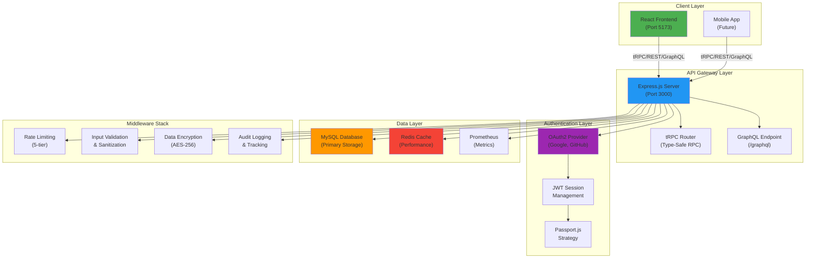
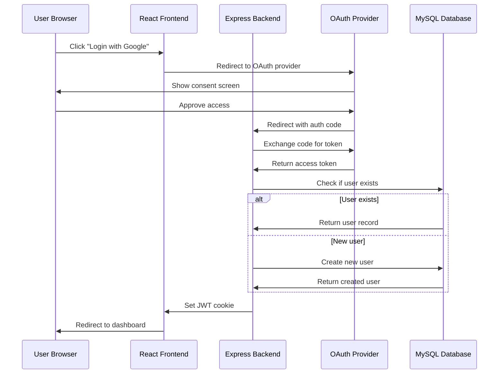
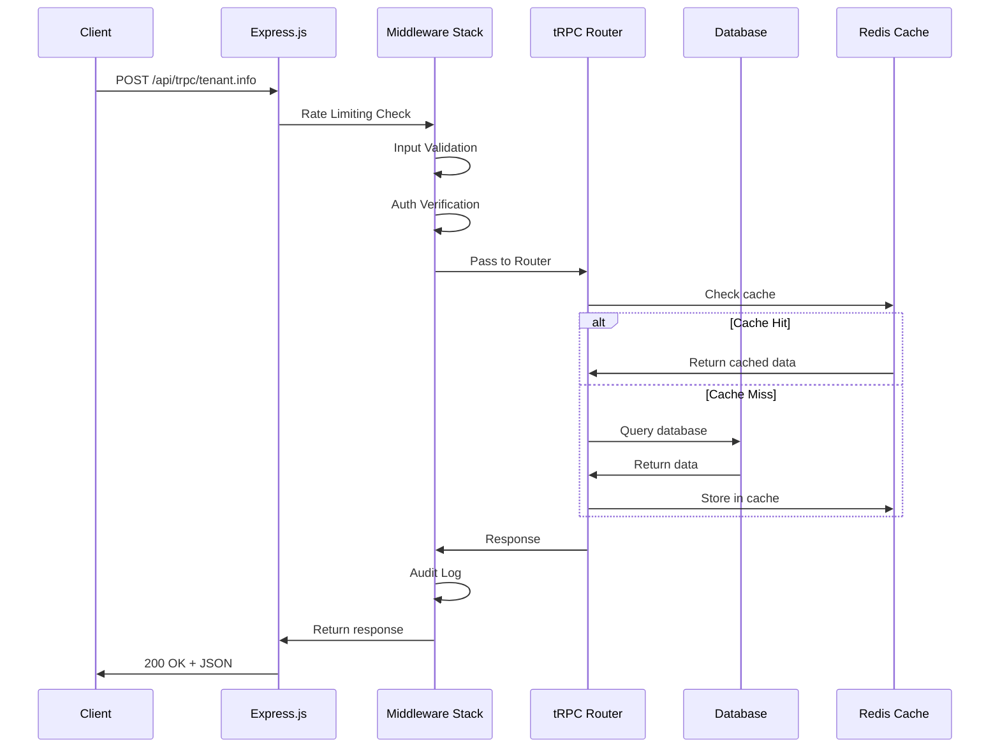
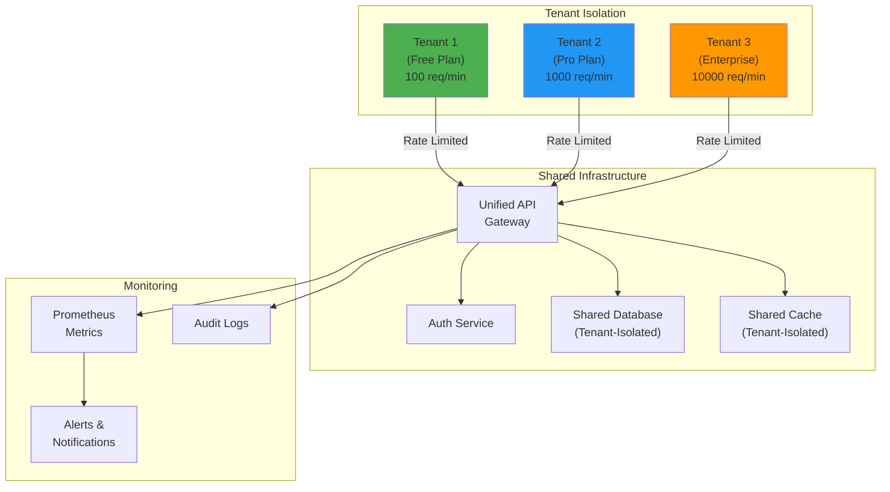
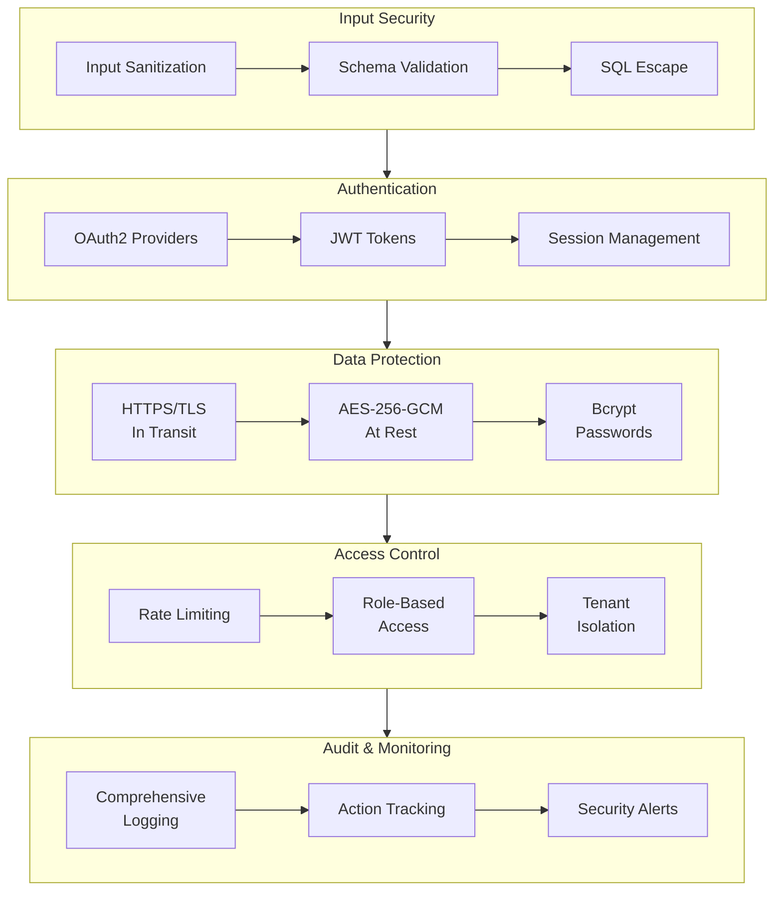
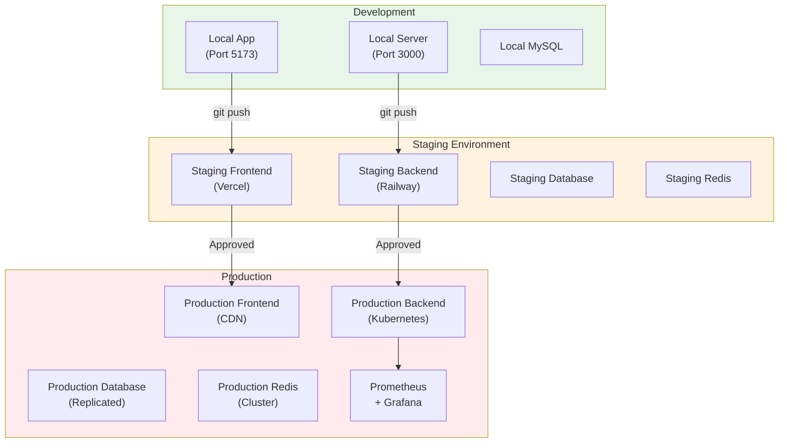
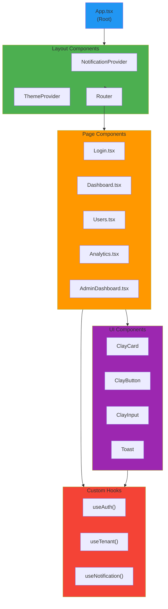
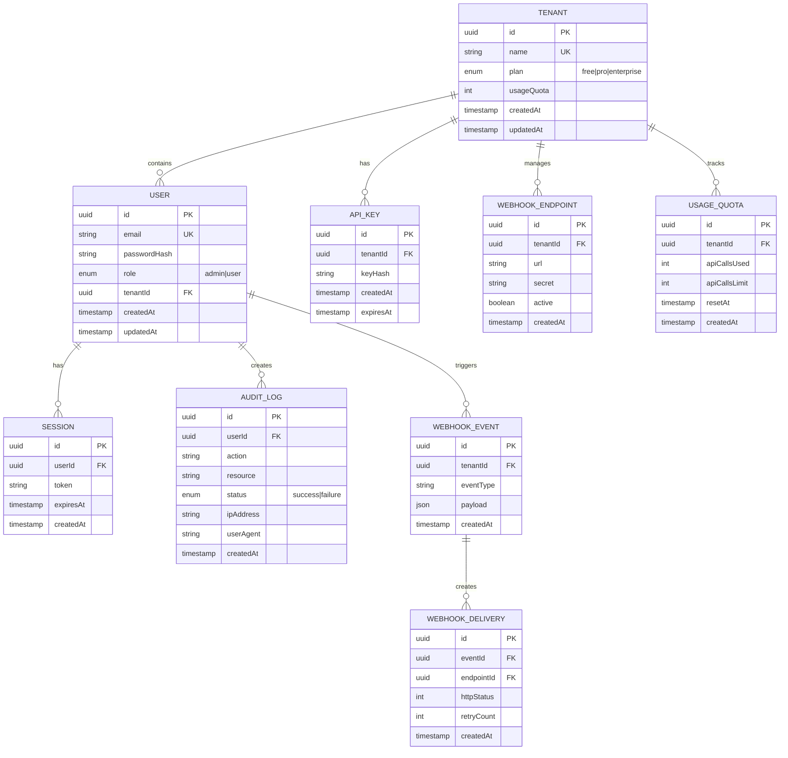

# System Architecture Diagrams

## 1. High-Level System Architecture

## 2. Data Flow: Authentication

## 3. Data Flow: API Request

## 4. Multi-Tenancy Architecture

## 5. Security Architecture

## 6. Deployment Architecture

## 7. Component Hierarchy

## 8. Database Schema Relationships

---

**All diagrams are created using Mermaid.js and can be rendered in any Markdown viewer or GitHub.**

